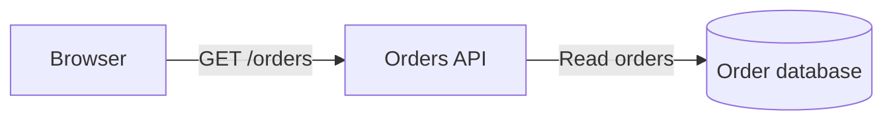
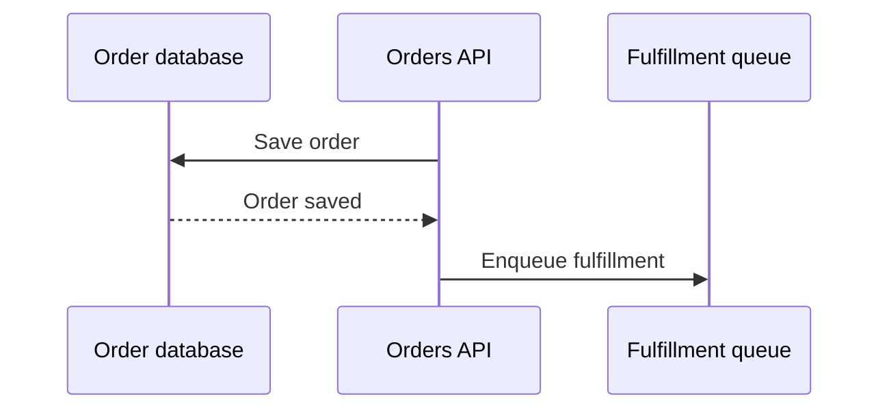

## Read orders

The Orders API reads the customer's orders from the database and returns them to the browser.

```mermaid
flowchart LR
    accTitle: Read orders through the Orders API
    Browser -->|GET /orders| API[Orders API]
    API -->|Read orders| DB[(Order database)]
```

## Queue fulfillment

The API stores the order before it queues a fulfillment job.

```mermaid
sequenceDiagram
    accTitle: Save an order and enqueue fulfillment
    participant DB as Order database
    participant API as Orders API
    participant Queue as Fulfillment queue
    API->>DB: Save order
    DB-->>API: Order saved
    API->>Queue: Enqueue fulfillment
```
